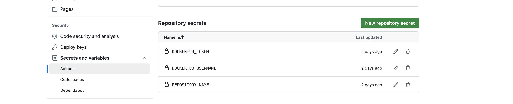

# CI/CD and Kubernetes (EKS)
For deploying cloud-native applications safely and efficiently on Kubernetes, we need something different from traditional CI/CD pipelines. It should follow the same declarative way used by k8s to manage applications:

Injecting Kubernetes objects through a declarative document as YAML or JSON.
Kubernetes Operators processing endlessly, evaluating the difference between the submitted objects and their real state in the cluster.
 
# Why GitOps?
GitOps is especially suited to deploy cloud-native applications on Kubernetes following the above methodology while retaining it's underlying philosophy:

- Use Git repo as single source of truth
- changes are triggered with a Git commit
- When the state of repo changes, same changes are enforced inside the cluster.

# Our GitOps flow

**Tools**

- **ArgoCD** - it lives inside our cluster and is responsible for deploying changes commited to repo.
- **Github Actions** - it is responsible for building & pushing image to docker hub, and commit the latest image tag back to infra repo.
- **Helm charts** - it defines a package of pre-configured resources that can be deployed in a Kubernetes cluster

*Please reference to this repository to get IaC code https://github.com/triethuynh1408/devops-elsa-exam*

# Prerequisites
  - Create Infrastructure (EKS, ArgoCD) and Helm Chart by repository https://github.com/triethuynh1408/devops-elsa-exam/tree/main
  - Create Docker Hub Registry (https://docs.docker.com/docker-hub/quickstart/)
    
  - Configure  Docker Hub, ArgoCD and GitHub secrets
    - In your GitHub  repository, go to the `Settings` tab.
    - In the left sidebar, click on `Secrets and variables` and choose `Actions` 
    - Click on the `New repository secret` button.
    - Add the following secrets:
      - Name: `DOCKERHUB_USERNAME`, Value: [Your Docker Hub username]
      - Name: `DOCKERHUB_TOKEN`, Value: [Your Docker Hub access token]
      - Name: `REPOSITORY_NAME`, Value: [Your repository name]
      - Name: `ARGOCD_URL`, Value: [Your URL ArgoCD]
      - Name: `ARGOCD_USER`, Value: [Your Username ArgoCD]
      - Name: `ARGOCD_PASSWORD`, Value: [Your Password ArgoCD]
    

## CI Flow 
  - GitHub Actions workflow to build Docker Image and push to DockerHub
    - Create Dockerfile for Web App 
    - In your GitHub repository, create the directory `.github/workflows`
    - Create a new file named `node.js.yml` 
    - Add a job to build and push the Docker image to Docker Hub
    - Commit and push the changes to the `dev` branch
    - Open a pull request to merge the dev branch into the main branch
    - Watch the workflow run and verify that the Docker image is pushed to Docker Hub

## CD Flow
  - Github Actions job will login into ArgoCD and update image tag from CI steps for Application and sync again to pull new image tag from Docker Hub and re-deploy into EKS Cluster

